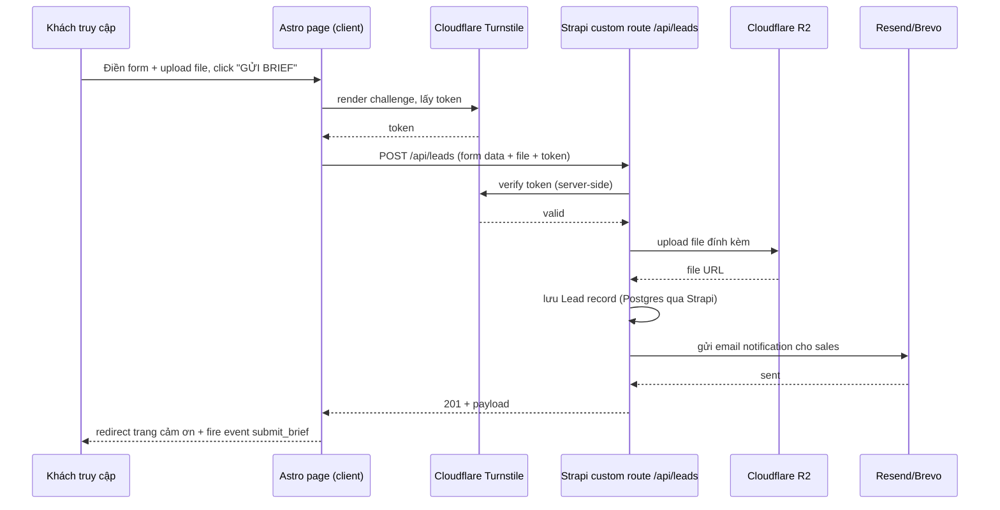

# Solution Design: GuAI Studio Website

**Author:** Solution Architect (via /solution-design)
**Date:** 2026-08-04
**Brainstorm ref:** plans/260804-2236-guai-studio-website/brainstorm-summary.md
**Status:** draft

---

## 1. Context

- **Problem:** Xây website company profile + portfolio cho GuAI Studio (AI Creative & Media Studio). Team operation non-tech cần tự cập nhật nội dung (services, case study, Virtual KOL) qua CMS, không cần dev can thiệp mỗi lần đổi content. Chỉ có 1 dev part-time bảo trì. Website cần SEO tốt (đa trang, không phải one-page). Không trả phí SaaS hàng tháng, chỉ trả VPS + domain.
- **Constraints:** VPS ngân sách tiết kiệm (~$5-12/mo, khuyến nghị tối thiểu 2GB RAM); video không tự host phần portfolio (dùng YouTube), chỉ hero showreel tự host nhẹ; 1 dev part-time — kiến trúc phải dễ hiểu/dễ AI-agent hỗ trợ bảo trì; có tiền sử gặp sự cố VPS full disk với docker-compope trước đây (nguyên nhân nghi ngờ: thiếu log rotation).
- **Success criteria:** Multi-page site được Google index đầy đủ trong vài tuần; Core Web Vitals tốt; non-tech ops publish content mà không cần dev; $0 chi phí SaaS hàng tháng ngoài VPS/domain; form liên hệ hoạt động ổn định có email notification.
- **Non-goals:** Không làm real-time content (độ trễ publish vài giây-vài phút chấp nhận được); không tự host video portfolio; không xây hệ thống blog/CMS đa tenant.

**Cập nhật sau review (2026-08-04):** Đã chốt 5 câu hỏi mở — xem mục 11.

## 2. Approaches Evaluated

Kiến trúc tổng (Astro + Strapi + Postgres) đã được chốt ở brainstorm. Quyết định kiến trúc còn mở ở tầng này là: **cơ chế publish → rebuild → deploy chạy ở đâu và như thế nào.** Đây là quyết định ảnh hưởng trực tiếp tới rủi ro tài nguyên VPS (vốn đã có tiền sử sự cố) nên cần đánh giá kỹ trước khi lock.

### Approach A: Webhook listener chạy trên VPS, build local
Strapi bắn webhook tới 1 service Node/Express nhỏ chạy thường trực trên chính VPS. Service này nhận request, chạy `astro build` ngay trên VPS, rồi swap thư mục Nginx đang serve.

**Pros:**
- Không phụ thuộc dịch vụ ngoài (GitHub Actions), toàn bộ pipeline nằm trong tầm kiểm soát VPS.
- Setup đơn giản, ít credential/secret phải quản lý (chỉ cần secret giữa Strapi↔webhook).
- Độ trễ deploy thấp nhất vì không có round-trip ra ngoài.

**Cons:**
- Build (`npm install` + `astro build`) cạnh tranh CPU/RAM trực tiếp với Strapi + Postgres đang chạy trên cùng VPS 2GB — rủi ro nghẽn/OOM khi content tăng dần.
- Phải cài toolchain Node/npm/Astro deps trực tiếp trên VPS production, tăng bề mặt cần patch/update.
- Đúng dạng rủi ro "tài nguyên VPS âm thầm bị ăn mòn" giống sự cố docker-compose full disk trước đây — build cache, node_modules, dist cũ tích tụ nếu không dọn kỹ.

### Approach B: CI build off-VPS (GitHub Actions) + deploy qua rsync/SSH
Strapi lifecycle hook gọi GitHub API (`repository_dispatch`) khi publish. GitHub Actions checkout code, fetch content từ Strapi REST API, chạy `astro build` trên runner của GitHub (miễn phí), rồi rsync kết quả qua SSH lên VPS, swap symlink release.

**Pros:**
- Toàn bộ compute cho build nằm ngoài VPS — VPS chỉ cần chạy Strapi + Postgres + Nginx, không bao giờ phải gánh thêm tải build. Loại bỏ hẳn rủi ro resource contention/OOM trên VPS nhỏ.
- Build log/history hiển thị rõ trên GitHub UI — dễ debug hơn nhiều so với log ẩn trong 1 service tự viết chạy trên VPS.
- Free tier GitHub Actions (2000 phút/tháng cho private repo) dư dùng cho tần suất publish của 1 company site — không phát sinh chi phí, giữ đúng ràng buộc "$0 SaaS".
- Tách biệt build environment khỏi production server → giảm bề mặt cần patch trên VPS, giảm nguy cơ tái diễn kiểu sự cố "tài nguyên VPS bị ăn ngầm" đã từng gặp.

**Cons:**
- Thêm phụ thuộc vào GitHub Actions uptime (rất hiếm downtime, và nếu có chỉ trễ publish mới, không ảnh hưởng site đang chạy).
- Cần quản lý thêm 1 SSH deploy key (secret trên GitHub) + đảm bảo Strapi có token gọi được GitHub API.
- Setup ban đầu phức tạp hơn 1 chút (viết GitHub Actions workflow YAML thay vì chỉ 1 script).

## 3. Comparison

| Dimension | A: On-VPS webhook | B: GitHub Actions CI |
|---|---|---|
| Implementation effort | Thấp | Trung bình |
| Operational complexity | Trung bình (thêm 1 service thường trực + toolchain build trên VPS) | Thấp trên VPS (chỉ nhận file đã build), thêm phụ thuộc ngoài |
| Scalability ceiling | Thấp — build cạnh tranh tài nguyên với Strapi/Postgres khi content tăng | Cao — build luôn chạy trên runner riêng, không phụ thuộc content volume |
| Security surface | Trung bình (1 webhook endpoint public cần HMAC) | Trung bình (SSH deploy key + GitHub token, nhưng không có endpoint public nhận webhook trực tiếp lên VPS) |
| Testability | Trung bình — khó xem log lỗi build từ xa | Cao — GitHub Actions UI có log/history đầy đủ |
| Team familiarity | Cao (Node/Express quen thuộc) | Cao (GitHub Actions rất phổ biến, AI-agent-friendly) |
| Reversibility | Cao (dễ đổi sau) | Trung bình (gắn với GitHub, nhưng rủi ro thấp vì đằng nào cũng lưu code trên GitHub) |

## 4. Recommendation: Approach B (GitHub Actions CI)

**Why:** Ràng buộc nặng nhất của dự án là VPS ngân sách nhỏ (2GB RAM) đã phải gánh Strapi + Postgres + Nginx, và đã từng có tiền sử sự cố tài nguyên VPS không rõ nguyên nhân. Approach B loại bỏ hoàn toàn rủi ro build cạnh tranh tài nguyên trên VPS, tách production server ra khỏi build toolchain, và tận dụng free tier GitHub Actions vẫn giữ đúng ràng buộc "$0 SaaS hàng tháng".

**Trade-offs we accept:** Chấp nhận thêm 1 phụ thuộc ngoài (GitHub Actions) và phải quản lý thêm 1 SSH deploy key, đổi lấy việc bảo vệ VPS khỏi rủi ro resource contention — đánh đổi hợp lý vì GitHub Actions cực kỳ ổn định và miễn phí trong scope sử dụng này.

## 5. Core Workflow

### 5.1 Flowchart — Publish → Rebuild → Deploy

```mermaid
flowchart LR
    Ops[Ops team] -->|Publish content| Strapi[Strapi Admin]
    Strapi -->|lifecycle hook: afterUpdate/afterCreate| Dispatch[repository_dispatch API call]
    Dispatch --> GHA[GitHub Actions runner]
    GHA -->|GET /api/*?populate=*| StrapiAPI[Strapi REST API]
    GHA -->|astro build| Dist[dist/ static files]
    GHA -->|rsync over SSH| Release[VPS: releases/{sha}]
    Release -->|symlink swap| Current[VPS: current -> Nginx serves]
```

### 5.2 Sequence Diagram — Publish → Rebuild → Deploy

```mermaid
sequenceDiagram
    participant Ops as Ops (non-tech)
    participant Strapi as Strapi CMS
    participant GH as GitHub Actions
    participant Astro as Astro Build
    participant VPS as VPS (Nginx)

    Ops->>Strapi: Click "Publish" (Case Study/Service/KOL)
    Strapi->>GH: POST repository_dispatch (HMAC signed)
    GH->>Strapi: GET /api/case-studies?populate=* (+ services, kols, settings)
    Strapi-->>GH: JSON content
    GH->>Astro: npm ci && astro build
    Astro-->>GH: dist/ (static HTML/CSS/JS)
    GH->>VPS: rsync dist/ -> /var/www/releases/{sha}
    GH->>VPS: ssh ln -sfn releases/{sha} current
    VPS-->>GH: deploy success
    Note over VPS: Nginx serve ngay bản mới; giữ 3 release gần nhất để rollback
```

### 5.3 Sequence Diagram — Contact Form / Lead Capture



## 6. Database Changes

Strapi quản lý schema qua Content-Type Builder, lưu xuống Postgres. Liệt kê ở cấp Content-Type (tương đương table).

**i18n:** Bật plugin `i18n` built-in của Strapi, 2 locale: `vi` (mặc định) và `en`. Áp dụng cho các content-type có nội dung hiển thị công khai (`service`, `case-study`, `virtual-kol`, `site-setting`); field không cần dịch (slug dùng chung format, media, enum category) đánh dấu `localized: false` trong schema để tránh ops phải nhập trùng lặp không cần thiết. `lead` không cần i18n (dữ liệu nội bộ, không hiển thị công khai).

**New collection types:**
- `service` — `title` (i18n), `slug` (unique, không i18n), `short_description` (i18n), `full_description` (richtext, i18n), `icon` (media), `order` (int), `seo` (component seo-meta, i18n), quan hệ `case_studies` (one-to-many ngược từ `case-study`). Khớp 4 dịch vụ trong brief: AI Video Production, Virtual KOL, AI Ad Creative, AI Content Factory.
- `case-study` (Portfolio/Work) — `title` (i18n), `slug` (unique, không i18n), `category` (enum: Fashion/Beauty/F&B/Real Estate/Character/UGC/Cinematic..., không i18n), `youtube_video_url` (không i18n), `thumbnail` (media, lưu qua R2 provider), `description` (i18n), `featured` (boolean), quan hệ `service` (many-to-one), `seo` (component, i18n).
- `virtual-kol` — `name` (không i18n, tên riêng), `character_type` (enum, không i18n), `avatar` (media), `short_bio` (i18n), `demo_video_youtube_url` (không i18n), `order`.
- `lead` — `full_name`, `company`, `contact` (email hoặc phone), `website_or_facebook`, `needs` (json/enum multi: AI Video/AI KOL/AI Ads/Social Content/Xây Channel/Khác), `project_description`, `attachment` (media, R2), `status` (enum: new/contacted/closed, mặc định `new`), `submitted_at`. **Không public API read** — chỉ admin Strapi xem được, chặn `find`/`findOne` permission cho public role. Không cần i18n.

**New single type:**
- `site-setting` — `site_name` (không i18n), `tagline` (i18n), `showreel_video` (media, self-hosted, không qua R2 vì file nhỏ và cần load nhanh cho hero), `logo`, `phone`, `email`, `zalo_link`, `social_links` (json), `default_seo` (component seo-meta, i18n).

**New reusable component:**
- `seo-meta` — `meta_title`, `meta_description`, `og_image` (media). Dùng lại trong `service`, `case-study`, `site-setting`.

**Changed:** none (greenfield).

**Dropped:** none.

**Migration path:** Strapi tự sinh migration khi định nghĩa content-type qua Content-Type Builder hoặc schema JSON (`src/api/*/content-types/*/schema.json`), apply tự động khi Strapi khởi động (`strapi.db.migrations`). Không cần viết SQL tay. Maintenance window: không cần (greenfield, chưa có data production).

## 7. Key Changes

Monorepo, phù hợp cho 1 dev part-time dễ quản lý (1 chỗ duy nhất để mở, build, deploy).

### New files/thư mục
```
guai-studio-website/
├── apps/
│   ├── cms/                              # Strapi project
│   │   ├── src/api/service/              # content-type: service
│   │   ├── src/api/case-study/           # content-type: case-study
│   │   ├── src/api/virtual-kol/          # content-type: virtual-kol
│   │   ├── src/api/lead/                 # content-type: lead (custom controller cho submit + upload R2 + gửi mail)
│   │   ├── src/api/site-setting/         # single type
│   │   ├── src/components/seo/seo-meta.json
│   │   ├── config/plugins.ts             # cấu hình provider upload R2, provider email Resend/Brevo
│   │   └── Dockerfile
│   └── web/                              # Astro project
│       ├── src/pages/index.astro                    # VI (default locale, không prefix)
│       ├── src/pages/services/index.astro
│       ├── src/pages/services/[slug].astro
│       ├── src/pages/work/index.astro
│       ├── src/pages/work/[slug].astro
│       ├── src/pages/ai-kol.astro
│       ├── src/pages/about.astro
│       ├── src/pages/contact.astro
│       ├── src/pages/en/index.astro                 # EN (prefixed /en/*)
│       ├── src/pages/en/services/index.astro
│       ├── src/pages/en/services/[slug].astro
│       ├── src/pages/en/work/index.astro
│       ├── src/pages/en/work/[slug].astro
│       ├── src/pages/en/ai-kol.astro
│       ├── src/pages/en/about.astro
│       ├── src/pages/en/contact.astro
│       ├── src/lib/strapi-client.ts      # fetch wrapper gọi Strapi REST API tại build-time, hỗ trợ param locale
│       ├── src/lib/seo.ts                # helper sinh meta/OG/JSON-LD + hreflang alternate từ seo-meta component
│       └── astro.config.mjs              # tích hợp @astrojs/sitemap, i18n config (defaultLocale: vi, locales: [vi, en], prefixDefaultLocale: false)
├── infra/
│   ├── docker-compose.yml                # strapi + postgres (production, có logging max-size/max-file)
│   ├── nginx/guai-studio.conf            # reverse proxy + serve static release qua symlink current/
│   └── scripts/prune-docker.sh           # cron: docker system prune định kỳ
├── .github/workflows/build-and-deploy.yml
└── plans/                                # brainstorm + solution design (đã có)
```

### Modified files
- Không có (greenfield, chưa có code trước đó).

### Deleted files
- none

### Migrations / schema
- Strapi schema JSON tự quản lý migration nội bộ, xem mục 6.

## 8. Side Effects

### Affected modules
- `apps/cms/config/plugins.ts` — cấu hình `@strapi/provider-upload-aws-s3` (tương thích R2 qua S3 API) và provider email (Resend/Brevo) — cả 2 đều là điểm tích hợp mới, cần API key lưu trong `.env`, không commit.
- `.github/workflows/build-and-deploy.yml` — cần secret `SSH_DEPLOY_KEY`, `VPS_HOST` lưu trong GitHub repo secrets.

### Affected features
- **Homepage hero showreel** — phụ thuộc `site-setting.showreel_video`; nếu ops quên upload, cần fallback poster image mặc định trong code, không để trống.
- **SEO metadata mọi trang** — phụ thuộc component `seo-meta`; nếu ops không điền, cần default fallback (site_name + short description) để tránh trang thiếu title/OG.
- **Song ngữ VI/EN** — mỗi trang cần cặp `<link rel="alternate" hreflang="vi/en">` trỏ chéo giữa 2 bản + `x-default` trỏ về bản VI (mặc định). Nếu ops chỉ dịch 1 phần nội dung sang EN (bỏ dở), trang `/en/*` tương ứng sẽ thiếu nội dung — cần fallback hiển thị bản VI kèm banner "bản dịch đang cập nhật" thay vì trang trắng/404.
- **Analytics events** — `view_work` (khi vào /work hoặc /work/[slug]), `play_showreel` (click play hero), `click_contact` (click CTA Zalo/Messenger/Phone), `start_brief` (focus vào form), `submit_brief` (submit thành công) — implement qua GA4 `gtag` + Meta Pixel `fbq`, gắn ở các component tương ứng trong Astro (dùng client-side script, không ảnh hưởng SSG).

### Breaking changes
- Không có (dự án mới hoàn toàn).

### Regression risk areas
- Webhook `repository_dispatch` từ Strapi — nếu Strapi publish nhiều lần liên tiếp trong thời gian ngắn (vd ops sửa content nhiều lần), có thể trigger nhiều build chồng chéo. Cần debounce (chỉ dispatch nếu build trước đã xong, hoặc GitHub Actions concurrency group hủy build cũ khi có build mới).
- Route `/api/leads` (POST public) — bề mặt duy nhất Strapi expose ra public không qua CMS thông thường, cần rate-limit riêng ngoài Turnstile để chống spam/abuse.
- R2 free tier limit (10GB) — nếu ops upload nhiều ảnh/video gốc chưa nén, có thể chạm ngưỡng; cần enforce resize/optimize trước khi lưu (Strapi có thể cấu hình responsive image breakpoints).

## 9. Dependencies

- **External services:** GitHub (repo + Actions), Cloudflare (DNS proxy + R2 + Turnstile), Resend hoặc Brevo (email), YouTube (embed portfolio/case-study/KOL video).
- **New libraries:** Strapi v5, `@strapi/provider-upload-aws-s3` (R2 qua S3-compatible API), Astro, `@astrojs/sitemap`, Postgres driver (`pg`), Turnstile client script.

## 10. Risks & Mitigations

| Risk | Likelihood | Impact | Mitigation |
|---|---|---|---|
| VPS RAM nghẽn khi Strapi+Postgres chạy cùng lúc content tăng | M | H | Approach B loại bỏ tải build khỏi VPS; theo dõi RAM qua cron alert; nâng cấp VPS nếu cần |
| Webhook trigger nhiều build chồng chéo khi publish liên tiếp | M | M | Dùng GitHub Actions `concurrency` group để hủy build cũ khi có build mới |
| Docker log/disk tích tụ lại (tái diễn sự cố cũ) | M | H | `logging.max-size/max-file` bắt buộc trong docker-compose.yml; cron `docker system prune` hàng tuần; alert disk >80% |
| R2 free tier (10GB) bị vượt nếu upload ảnh/video gốc chưa nén | L | M | Cấu hình resize/optimize ảnh trong Strapi trước khi lưu; giữ video chỉ hero (nhẹ), còn lại luôn YouTube |
| Ops publish nhưng quên điền SEO/hero fallback gây trang lỗi thiếu meta | M | L | Default fallback ở tầng code (site_name/description) khi field CMS trống |
| Deploy key GitHub bị lộ | L | H | Dùng deploy-only key giới hạn quyền (chỉ ghi vào 1 thư mục cụ thể trên VPS), rotate định kỳ |
| Repo + Actions nằm trên GitHub cá nhân dev part-time — rủi ro bàn giao nếu ngưng hợp tác | M | M | Khách nên có bản sao quyền truy cập (collaborator hoặc transfer sang GitHub Org của khách khi ổn định); ghi rõ trong hợp đồng/tài liệu bàn giao |
| Nội dung EN dịch dở dang, thiếu trang | M | L | Fallback hiển thị bản VI + banner "đang cập nhật bản dịch" thay vì để trống/404 |

## 11. Open Questions — Đã chốt (2026-08-04)

| # | Câu hỏi | Quyết định | Việc cần làm |
|---|---|---|---|
| 1 | Song ngữ VI/EN? | **Có**, VI mặc định | Bật i18n Strapi + routing `/en/*` (đã cập nhật mục 6, 7, 8) |
| 2 | Domain đã có hay đăng ký mới? | **Đăng ký mới** | Chốt tên domain trước khi setup Cloudflare DNS; cần làm sớm vì DNS propagation + cert issuance cần thời gian |
| 3 | Host repo ở đâu? | **GitHub cá nhân của dev part-time** | Đã thêm rủi ro bàn giao vào mục 10 (risk table) — khuyến nghị thêm khách làm collaborator ngay từ đầu |
| 4 | VPS provider? | **Chưa chốt — cần gửi báo giá cho khách chọn** | Xem bảng so sánh VPS đính kèm bên dưới (ngoài doc này), gửi khách trước khi bắt đầu phase infra setup ở `/plan` |
| 5 | Ai training team ops? | **Dev part-time (chính là người thực hiện dự án) phụ trách bàn giao** | Thêm deliverable "tài liệu hướng dẫn sử dụng Strapi cho non-tech ops" vào scope — xem mục 12 |

## 12. Next Steps

- Chốt domain name + đăng ký (câu hỏi #2) — làm sớm song song với các bước dưới vì DNS/cert cần thời gian propagate.
- Gửi bảng báo giá VPS cho khách chọn (câu hỏi #4) trước khi bắt đầu phase infra setup.
- Thêm deliverable vào scope: **tài liệu hướng dẫn sử dụng Strapi admin** (viết nội dung, upload media, publish) dành cho team ops non-tech — bàn giao cùng lúc go-live.
- Invoke `/plan` với solution design này làm input để tạo implementation plan theo phase (setup infra → Strapi content model + i18n → **design system (typography/spacing/color tokens/dark mode/component cơ bản trước khi build trang)** → Astro pages/SEO/routing đa ngôn ngữ → contact form/lead pipeline → CI/CD pipeline → tài liệu bàn giao → go-live checklist). Design system đi trước page-building để tránh phải sửa lại UI rải rác nhiều nơi khi đổi token màu/spacing sau này — tham khảo từ [dtquocbao.com case study](https://www.dtquocbao.com/blog/how-i-built-dtquocbao-com-my-personal-portfolio-blog-cms).
