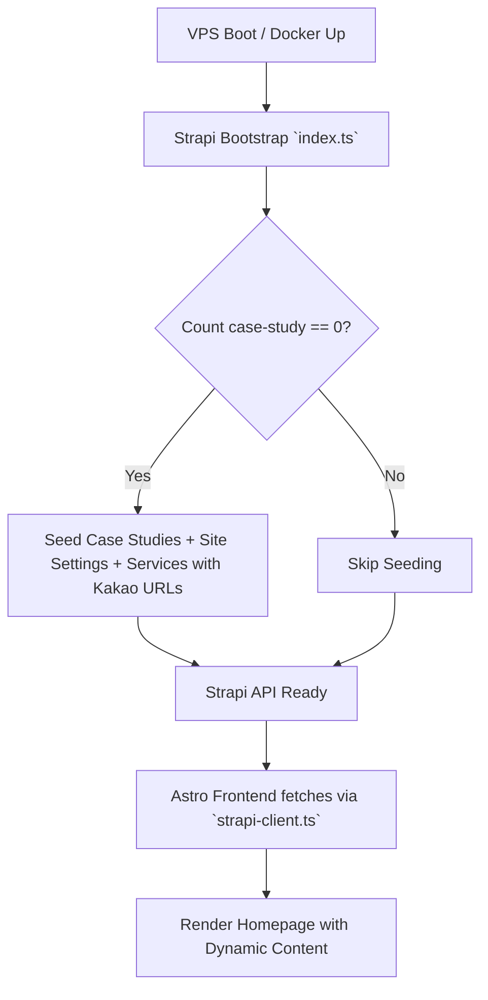
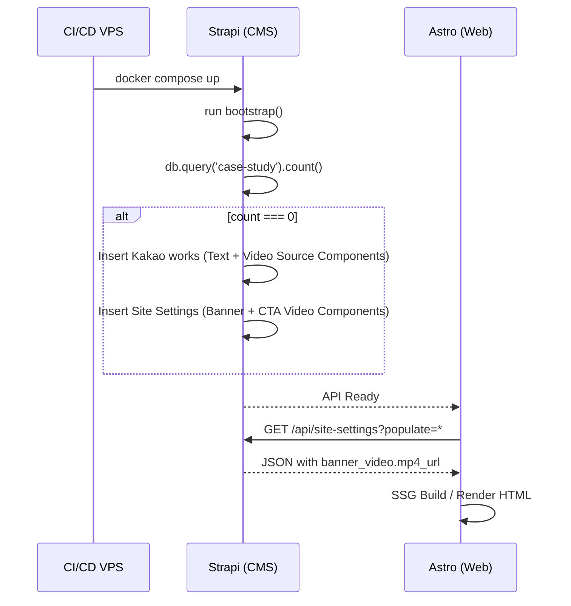

# Solution Design: Homepage Content & Video Dynamic Loading via Strapi

**Author:** Solution Architect (via /solution-design)
**Date:** 2026-08-10
**Brainstorm ref:** docs/brainstorms/2026-08-10-homepage-video-dynamic-load.md
**Status:** draft

---

## 1. Context

- **Problem:** All homepage videos and the "Works" (Case Studies) text content are currently hardcoded in Astro using the Kakao theme HTML. Strapi must become the single source of truth.
- **Constraints:** Must use String URLs for video sources (not Media file uploads during boot) to ensure instant, zero-risk seeding without massive R2 uploads.
- **Success criteria:** Zero hardcoded Kakao URLs or text in Astro. Auto-seeding works flawlessly on first VPS boot.
- **Non-goals:** Not modifying the Strapi Media Library provider (R2 remains active for future admin uploads).

## 2. Approaches Evaluated

### Approach 1: Flat Schema Fields (Direct Attributes)
Add individual string fields (`video_mp4_url`, `video_webm_url`, `poster_url`) directly to the root of `site-setting`, `case-study`, and `service` content types. The bootstrap script in `index.ts` hardcodes the creation payloads.

**Pros:**
- Simplest to implement, no new structural concepts.
- Easy to query in Astro without deep populate flags.

**Cons:**
- Duplicates 3 fields across 3 different content types (violates DRY).
- If we ever add a 3rd video format or setting (e.g., `autoplay`), we have to update 3 separate schemas.

### Approach 2: Reusable Strapi Component (Component Schema)
Create a new Strapi Component `shared.video-source` containing `mp4_url`, `webm_url`, and `poster_url`. Attach this component to `site-setting` (as `banner_video` and `cta_video`), `case-study` (as `video`), and `service` (as `featured_video`).

**Pros:**
- Extremely DRY. Video source structure is defined exactly once.
- Easy to extend in the future.
- Keeps content-type root schemas clean.

**Cons:**
- Requires adding `populate: ['banner_video', 'cta_video', 'video']` to the Astro client fetch queries.
- Slightly more complex to write the schema JSON by hand.

## 3. Comparison

| Dimension | A1 (Flat Schema) | A2 (Component Schema) |
|---|---|---|
| Implementation effort | Low | Medium |
| Operational complexity | Low | Low |
| Scalability | Low | High (Reusable) |
| Security surface | Identical | Identical |
| Testability | High | High |
| Team familiarity | High | High |
| Reversibility | Medium | Medium |

## 4. Recommendation: Approach 2

**Why:** Approach 2 (Component Schema) is the architecturally correct way to handle repeated structures in Strapi. It prevents duplicating the triad of `mp4_url`, `webm_url`, and `poster_url` across multiple API endpoints, keeping the data model clean and maintainable. 

**Trade-offs we accept:** We accept the slight overhead of needing to specify `populate` rules in the Astro frontend queries, which is standard practice in Strapi v5 anyway.

## 5. Core Workflow

### 5.1 Flowchart

### 5.2 Sequence Diagram

## 6. Database Changes

**New components:**
- `shared.video-source` — Stores external video links. Fields: `mp4_url` (String), `webm_url` (String), `poster_url` (String).

**Changed tables:**
- `site-setting` — Added `banner_video` (Component: shared.video-source), `cta_video` (Component: shared.video-source).
- `case-study` — Added `video` (Component: shared.video-source).
- `service` — Added `featured_video` (Component: shared.video-source).

**Dropped:**
- none

**Migration:** Managed automatically by Strapi upon restart based on schema JSON changes. No manual SQL required.

## 7. Key Changes

### New files
- `apps/cms/src/components/shared/video-source.json` — Defines the reusable video component schema.

### Modified files
- `apps/cms/src/api/site-setting/content-types/site-setting/schema.json` — Add component links.
- `apps/cms/src/api/case-study/content-types/case-study/schema.json` — Add component link.
- `apps/cms/src/api/service/content-types/service/schema.json` — Add component link.
- `apps/cms/src/index.ts` — Add `seedHomepageData` function inside the `bootstrap` lifecycle to populate Kakao defaults.
- `apps/web/src/lib/strapi-client.ts` — Update `populate` parameters to fetch the nested components and update TypeScript mock interfaces.
- `apps/web/src/pages/index.astro` — Remove hardcoded HTML and wire up dynamic API data for Works (content + videos), Banner, and CTA.

### Deleted files
- none

### Migrations / schema
- Strapi auto-syncs schemas. Seeding handled in `bootstrap`.

## 8. Side Effects

### Affected modules
- **Astro Homepage Rendering:** The homepage will strictly depend on the Strapi API response structure. If `strapi-client.ts` fails to map the populated components, the video sections will break.

### Affected features
- **CMS Admin UI:** Content editors will see a clean, grouped Component block for video URLs instead of scattered string fields.

### Breaking changes
- none (This is additive to the schema).

### Regression risk areas
- The fallback logic in `strapi-client.ts` (when Strapi is offline) must be carefully updated to match the new Component structure to prevent Astro build failures in offline dev mode.

## 9. Dependencies
- none

## 10. Risks & Mitigations

| Risk | Likelihood | Impact | Mitigation |
|---|---|---|---|
| Astro fails to parse populated component data | M | H | Log strict type errors in `strapi-client.ts` and ensure deep populate is used (`populate: ['banner_video', 'video']`). |
| Seeding runs twice and duplicates data | L | M | Use `count()` checks in bootstrap before inserting. Use `findOne` for single types. |

## 11. Open Questions
- none

## 12. Next Steps
- Invoke `/plan` with this document as input to generate the implementation plan.
